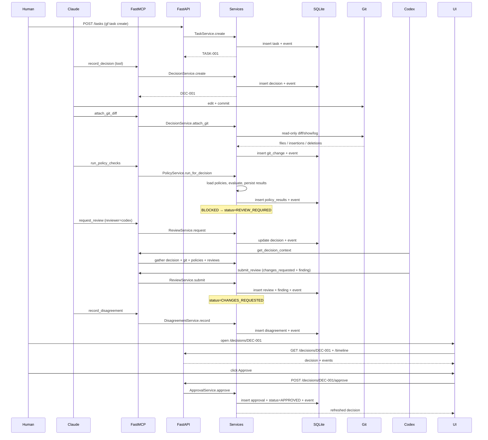

# GovForge — Software Architecture

> Software architecture of the Phase 1 codebase. For deployment topology
> (Podman, Caddy, Cloudflare tunnel), see the project-root `architecture.md`.

## At a glance

GovForge is a four-component system. Three of them run on a developer's
machine; the fourth (the marketing site) runs in production at
`govforge.dev`.

```
┌──────────────────────────────────────────────────────────────────┐
│  agents (Claude Code, Codex, Cursor, Cline, Aider, …)            │
│             │                                                    │
│             │ stdio                                              │
│             ▼                                                    │
│   ┌─────────────────────────┐                                    │
│   │   FastMCP server        │ ──┐                                │
│   │   (govforge.mcp)        │   │                                │
│   └─────────────────────────┘   │                                │
│                                 │     in-process                 │
│   ┌──────┐  HTTP   ┌────────────▼──────────────┐                 │
│   │ gf   │ ──────▶ │   FastAPI HTTP API        │                 │
│   │ CLI  │ :8787   │   (govforge.api)          │                 │
│   └──────┘         │                           │                 │
│                    │   ┌───────────────────┐   │                 │
│   ┌──────┐  HTTP   │   │  Service layer    │   │                 │
│   │ UI   │ ──────▶ │   │  (govforge.core   │   │                 │
│   │ :8788│         │   │   .services)      │   │                 │
│   └──────┘         │   └─────────┬─────────┘   │                 │
│                    │             │             │                 │
│                    │   ┌─────────▼─────────┐   │                 │
│                    │   │  Models + audit   │   │                 │
│                    │   │  (SQLAlchemy 2)   │   │                 │
│                    │   └─────────┬─────────┘   │                 │
│                    └─────────────┼─────────────┘                 │
│                                  ▼                               │
│                           ┌─────────────┐                        │
│                           │  SQLite DB  │  .govforge/govforge.db │
│                           └─────────────┘                        │
└──────────────────────────────────────────────────────────────────┘
                                  │
                                  ▼
                       (read-only) Git repo on disk
```

The four components are intentionally **all running locally**: no SaaS, no
network egress to a service we control. Phase 3 will introduce optional
cloud sync; Phase 1 stores everything in `.govforge/govforge.db`.

## Components

### 1. `gf` — Go CLI (`cli/`)

Single static binary. The user-facing surface. Talks to the backend over
HTTP on `127.0.0.1:8787`. Two exceptions:

- `gf init` is **autonomous** — it embeds the SQL schema and the default
  policies via `go:embed` and creates `.govforge/{config.toml, policies.toml,
  govforge.db}` without the backend running.
- `gf mcp serve` / `gf api serve` / `gf ui serve` are thin spawners that
  exec the matching Python entry point with `GOVFORGE_DB` pre-set.

### 2. Python backend (`backend/src/govforge/`)

Four packages, layered:

| Package    | Purpose                                                                        |
|------------|--------------------------------------------------------------------------------|
| `core`     | Domain logic. Models, services, policies, Git extractor. Pure Python.          |
| `api`      | FastAPI HTTP API on `127.0.0.1:8787`. CORS open to localhost UI ports.         |
| `mcp`      | FastMCP server (stdio transport). 11 tools, 5 resources, 3 prompts.            |
| `db`       | Engine + session factory + SQLite pragmas (`foreign_keys=ON`, WAL).            |

The MCP and API layers **share the service layer** — they don't reimplement
business logic. A tool/route call resolves human-friendly identifiers
(display IDs, agent names, project paths) into UUIDs, opens a fresh DB
session, calls a service, and serialises the result.

### 3. Cockpit UI (`ui/`)

Next.js 16 App Router. Reads from the FastAPI HTTP API; mutates via
`POST /decisions/{id}/{approve,reject}`. Stores the current project ID in
`localStorage` so refreshes keep context. Hydration-safe via
`useCurrentProject`.

### 4. Marketing site (`site/`)

Static export, separate codebase, deployed to `govforge.dev`. Out of scope
for this document — see `site/README.md`.

## Service layer

The service layer is the single source of mutating logic. Every mutating
service emits an `Event` row so the audit log is complete by construction.

```
┌──────────────────────────────────────────────────────────────┐
│  govforge.core.services                                      │
│                                                              │
│  ProjectService     ─ create / get_or_create                 │
│  TaskService        ─ create + display_id (TASK-NNN)         │
│  DecisionService    ─ create + attach_git + update_status    │
│  PolicyService      ─ run_for_decision (sync registry)       │
│  ReviewService      ─ request + submit (with findings)       │
│  DisagreementService─ record + resolve                       │
│  ApprovalService    ─ approve / reject / needs_changes       │
│  TimelineService    ─ for_decision / for_task                │
│  EventService       ─ log + list_for_entity / project        │
└──────────────────────────────────────────────────────────────┘
                          │
                          ▼ uses
┌──────────────────────────────────────────────────────────────┐
│  govforge.core.policies     │  govforge.core.git              │
│                             │                                 │
│  Policy ABC                 │  open_repo / resolve_commit     │
│  PolicyContext + Verdict    │  list_changed_files             │
│  5 default policies         │  count_changes                  │
│  TOML loader                │  get_diff_text                  │
│  Runner (pure)              │  assert_path_in_repo            │
└─────────────────────────────┴─────────────────────────────────┘
```

## Sequence — full Claude → Codex → human approval



## Audit log invariant

Every mutating service method calls `EventService.log(...)`. The `events`
table is append-only — there is no "delete event" code path. Combined with
the `decisions.git_attached` event carrying the diff hash, this gives
tamper-evidence:

- `events` is sorted by `created_at` (monotonic on a single machine);
- each `decision.git_attached` carries `commit_hash` + SHA-256 of the
  unified diff;
- the timeline can be replayed from the events table alone, without needing
  the rest of the schema.

## Identity scheme

| Entity          | Display ID  | Note                                        |
|-----------------|-------------|---------------------------------------------|
| Project         | (UUID)      | Stable; user-facing surface uses `name` / `root_path` |
| Agent           | (UUID)      | Identified by unique `name`                 |
| Task            | `TASK-NNN`  | Per-project zero-padded sequence            |
| Decision        | `DEC-NNN`   | Per-project zero-padded sequence            |
| Review          | `REV-NNN`   | Per-project zero-padded sequence            |
| Finding         | (UUID)      | Embedded inside its review                  |
| GitChange       | (UUID)      | Linked to a decision                        |
| Policy          | (UUID)      | Identified by unique `name` (e.g. `auth_change_requires_review`) |
| PolicyResult    | (UUID)      | Linked to a decision + policy               |
| Disagreement    | (UUID)      | Linked to a decision                        |
| Approval        | (UUID)      | Linked to a decision                        |
| Event           | (UUID)      | Append-only audit                           |

The `gf` CLI and the cockpit UI use display IDs (`TASK-001`, `DEC-001`,
`REV-001`) at every boundary; UUIDs are an internal detail.

## Cross-references

- Data model: [`data-model.md`](data-model.md)
- MCP integration: [`mcp-integration.md`](mcp-integration.md)
- Threat model: [`threat-model.md`](threat-model.md)
- Workflow walkthrough: [`workflow-example.md`](workflow-example.md)
