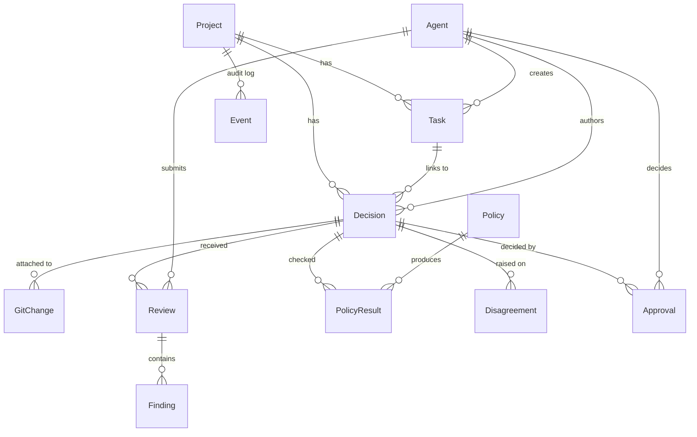

# GovForge — Data Model

12 entities. Source of truth: `backend/src/govforge/core/models.py` (SQLAlchemy 2,
modern style with `Mapped[...]` + `DeclarativeBase`).

## Entity overview

The relations are **strict trees**: a Decision's children cascade-delete
when the Decision is deleted. Events are exempt — they survive their
subjects so the audit log stays whole. `Agent` is cross-cutting and is
referenced by author/reviewer/approver/actor on every mutating entity.



## Entity reference

### Project

Root aggregate. One per Git repository (typically — nothing in the schema
forbids multiple).

| Column          | Type        | Note                          |
|-----------------|-------------|-------------------------------|
| `id`            | UUID PK     |                               |
| `name`          | str         | display name                  |
| `root_path`     | str unique  | absolute path on disk         |
| `default_branch`| str         | default `"main"`              |
| `created_at`    | datetime    | UTC                           |
| `updated_at`    | datetime    | UTC, auto-updated             |

### Agent

The actor on every mutating row. Represents both humans (`type=HUMAN`)
and AI agents (`CLAUDE`, `CODEX`, `CURSOR`, `CLINE`, `AIDER`, `OTHER`).

| Column          | Type        | Note                              |
|-----------------|-------------|-----------------------------------|
| `id`            | UUID PK     |                                   |
| `name`          | str unique  | e.g. `"claude"`, `"codex"`, `"eric"`|
| `type`          | enum        | `AgentType`                       |
| `metadata_json` | JSON?       | free-form per-agent metadata      |
| `created_at`    | datetime    |                                   |

### Task

A unit of work. Tasks are created by humans (typically); decisions are
created by agents acting on a task.

| Column          | Type        | Note                              |
|-----------------|-------------|-----------------------------------|
| `id`            | UUID PK     |                                   |
| `display_id`    | str         | `TASK-NNN` (per-project sequence) |
| `project_id`    | UUID FK     |                                   |
| `title`         | str         |                                   |
| `description`   | text?       |                                   |
| `risk_level`    | enum        | `RiskLevel`                       |
| `status`        | enum        | `TaskStatus`                      |
| `created_by_agent_id` | UUID FK? |                                  |
| `created_at`    | datetime    |                                   |
| `updated_at`    | datetime    |                                   |

Indexes: `(project_id, display_id)` unique, `(project_id, status)`.

### Decision (central primitive)

The unit of governance. Everything else hangs off a decision.

| Column                    | Type        | Note                                  |
|---------------------------|-------------|---------------------------------------|
| `id`                      | UUID PK     |                                       |
| `display_id`              | str         | `DEC-NNN`                             |
| `project_id`              | UUID FK     |                                       |
| `task_id`                 | UUID FK?    | optional task link                    |
| `author_agent_id`         | UUID FK     | who proposed it                       |
| `title`                   | str         |                                       |
| `summary`                 | text?       |                                       |
| `rationale`               | text?       |                                       |
| `status`                  | enum        | `DecisionStatus`                      |
| `risk_level`              | enum        |                                       |
| `human_approval_required` | bool        | gate flag                             |
| `created_at`              | datetime    |                                       |
| `updated_at`              | datetime    |                                       |

Status transitions:

```
DRAFT ──run_policy_checks (BLOCKED)──▶ REVIEW_REQUIRED
DRAFT ──request_review───────────────▶ REVIEW_REQUIRED
REVIEW_REQUIRED ──submit_review (changes)──▶ CHANGES_REQUESTED
REVIEW_REQUIRED ──submit_review (rejected)─▶ REJECTED
* ──approve──▶ APPROVED       (final)
* ──reject──▶ REJECTED        (final)
* ──needs_changes──▶ CHANGES_REQUESTED
```

### GitChange

Captures the Git state attached to a decision. Read-only — `core.git`
extracts and persists; nothing mutates the working tree.

| Column                  | Type     | Note                                            |
|-------------------------|----------|-------------------------------------------------|
| `id`                    | UUID PK  |                                                 |
| `decision_id`           | UUID FK  | cascade-delete                                  |
| `repo_path`             | str      | resolved absolute path                          |
| `branch_name`           | str?     | None on detached HEAD                           |
| `commit_hash`           | str      | full SHA                                        |
| `parent_commit_hash`    | str?     | None for initial commit                         |
| `diff_hash`             | str      | `sha256:<hex>` of the unified diff text         |
| `files_changed_json`    | JSON list of str | sorted file paths                       |
| `insertions`            | int      |                                                 |
| `deletions`             | int      |                                                 |

Multiple `GitChange` rows on one decision is normal (re-attach after a
follow-up commit).

### Review + Finding

A Review is a structured response from an agent (or human) to a decision.
Findings hang off the review.

`Review` columns:

| Column              | Type    | Note                                |
|---------------------|---------|-------------------------------------|
| `id`                | UUID PK |                                     |
| `display_id`        | str     | `REV-NNN`                           |
| `decision_id`       | UUID FK | cascade-delete                      |
| `reviewer_agent_id` | UUID FK |                                     |
| `status`            | enum    | `ReviewStatus`                      |
| `summary`           | text?   |                                     |
| `created_at`        | datetime|                                     |

`Finding`:

| Column           | Type     | Note                                   |
|------------------|----------|----------------------------------------|
| `id`             | UUID PK  |                                        |
| `review_id`      | UUID FK  | cascade-delete                         |
| `severity`       | enum     | `FindingSeverity`                      |
| `category`       | enum     | `FindingCategory`                      |
| `file_path`      | str?     |                                        |
| `line_start/end` | int?     | inclusive range                        |
| `message`        | text     | the problem (one sentence)             |
| `recommendation` | text?    | the fix (one sentence)                 |

### Policy + PolicyResult

`Policy` is the registry row (one per known policy name). `PolicyResult`
is the per-decision verdict.

`Policy`:

| Column        | Type    | Note                                            |
|---------------|---------|-------------------------------------------------|
| `id`          | UUID PK |                                                 |
| `name`        | str unique | e.g. `auth_change_requires_review`           |
| `description` | text?   |                                                 |
| `enabled`     | bool    |                                                 |
| `severity`    | enum    | `FindingSeverity`                               |
| `config_json` | JSON?   | per-policy config (patterns, thresholds, …)     |

`PolicyResult`:

| Column          | Type    | Note                                          |
|-----------------|---------|-----------------------------------------------|
| `id`            | UUID PK |                                               |
| `decision_id`   | UUID FK | cascade-delete                                |
| `policy_id`     | UUID FK |                                               |
| `status`        | enum    | `passed` / `warning` / `blocked`              |
| `message`       | text?   |                                               |
| `evidence_json` | JSON?   | matched files / patterns / thresholds         |

### Disagreement

A first-class structured disagreement between agents on a decision.
Resolution is optional and tracked separately.

| Column                    | Type        | Note                       |
|---------------------------|-------------|----------------------------|
| `id`                      | UUID PK     |                            |
| `decision_id`             | UUID FK     |                            |
| `topic`                   | str         |                            |
| `author_position`         | text?       |                            |
| `reviewer_position`       | text?       |                            |
| `risk_summary`            | text?       |                            |
| `requires_human_decision` | bool        | default true               |
| `resolution`              | text?       | filled when resolved       |
| `resolved_by_agent_id`    | UUID FK?    |                            |
| `resolved_at`             | datetime?   |                            |

### Approval

The human gate. One row per approval action.

| Column                | Type    | Note                                      |
|-----------------------|---------|-------------------------------------------|
| `id`                  | UUID PK |                                           |
| `decision_id`         | UUID FK |                                           |
| `approver_agent_id`   | UUID FK |                                           |
| `status`              | enum    | `ApprovalStatus`                          |
| `comment`             | text?   |                                           |
| `created_at`          | datetime|                                           |

`ApprovalService.approve` / `.reject` / `.needs_changes` map to the three
status values **and** also bump the parent decision's status.

### Event

The append-only audit log. Every mutating service writes here.

| Column            | Type    | Note                                     |
|-------------------|---------|------------------------------------------|
| `id`              | UUID PK |                                          |
| `project_id`      | UUID FK | for project-level feeds                  |
| `entity_type`     | str     | `decision` / `task` / `review` / …       |
| `entity_id`       | UUID    | not a FK — entities can be deleted       |
| `event_type`      | str     | dot-separated, e.g. `decision.approved`  |
| `actor_agent_id`  | UUID FK?| who triggered it                         |
| `payload_json`    | JSON?   | event-specific structured payload        |
| `created_at`      | datetime| ascending order = chronological          |

Known event types (Phase 1):

- `task.created`
- `decision.created`
- `decision.git_attached`
- `decision.policy_evaluated`
- `decision.status_changed`
- `decision.approved`
- `decision.rejected`
- `decision.needs_changes`
- `review.requested`
- `review.submitted`
- `disagreement.recorded`
- `disagreement.resolved`

## Enums (canonical values)

All enums are `StrEnum` so values are stable lowercase strings in JSON.
Source: `backend/src/govforge/core/enums.py`.

| Enum                  | Variants                                                          |
|-----------------------|-------------------------------------------------------------------|
| `RiskLevel`           | `low`, `medium`, `high`, `critical`                               |
| `TaskStatus`          | `open`, `in_progress`, `review_required`, `approved`, `rejected`, `closed` |
| `DecisionStatus`      | `draft`, `review_required`, `changes_requested`, `approved`, `rejected` |
| `ReviewStatus`        | `approved`, `changes_requested`, `commented`, `rejected`          |
| `FindingSeverity`     | `info`, `low`, `medium`, `high`, `critical`                       |
| `FindingCategory`     | `security`, `performance`, `architecture`, `bug`, `maintainability`, `tests` |
| `PolicyResultStatus`  | `passed`, `warning`, `blocked`                                    |
| `ApprovalStatus`      | `approved`, `rejected`, `needs_changes`                           |
| `AgentType`           | `human`, `claude`, `codex`, `cursor`, `cline`, `aider`, `other`   |

## Migration policy

Phase 1 ships a single embedded schema. The Go CLI's `gf init` writes the
embedded SQL directly. The Python backend uses `Base.metadata.create_all`
on first connect for tests; for production deploys (Phase 2+), Alembic
migrations live in `backend/src/govforge/db/migrations/` and are run via
`alembic upgrade head`.
