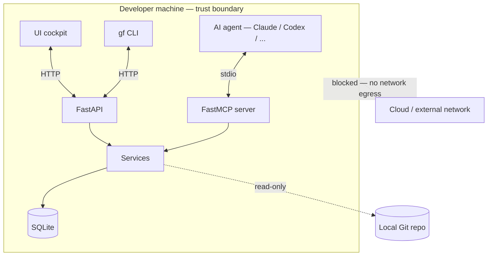

# Threat Model — Phase 1

> Source: `devis.md` §20, plus the security-attestation tests pinning each
> guarantee. Every claim below is enforced in CI — a regression that
> violates one fails [`backend/tests/unit/test_security.py`](../backend/tests/unit/test_security.py).

## Trust boundary

GovForge Phase 1 runs **entirely on a developer's machine**. There is no
SaaS component, no remote ingestion, no telemetry. Trust boundary is the
local OS user account.

## Principles (devis §20.1)

1. **No arbitrary shell.** GovForge MCP tools never invoke a shell. No
   `subprocess`, `os.system`, `popen`, `asyncio.create_subprocess`, no
   `eval` / `exec`.
2. **Git read-only.** The Git extractor only calls a documented allowlist
   of Git verbs. No `push`, `reset`, `rebase`, `checkout`, `commit`,
   `merge`, `gc`, `prune`, `clean`, `add`, `rm`, `mv`, `tag`, `branch`,
   `fetch`, `pull`.
3. **No secrets exfiltration.** No outbound network calls in Phase 1. The
   secret-detection policy reads diff content locally and tags it.
4. **No tracking.** No analytics, no phone-home, no "anonymous usage stats".
5. **Local logs only.** Every event lands in the SQLite audit log.
6. **Path traversal refused.** `assert_path_in_repo` rejects symlinks that
   escape the repo root after resolution.

## Tool exposure (devis §20.2)

The MCP server in Phase 1 is **deliberately small**. The forbidden
capabilities are *not implemented*:

| Forbidden (Phase 1)          | Status                                                |
|------------------------------|-------------------------------------------------------|
| Arbitrary shell execution    | ✗ no subprocess imports, asserted in CI                |
| Arbitrary file writes        | ✗ tools only mutate `.govforge/govforge.db`            |
| Arbitrary network access     | ✗ no `httpx`/`requests` calls in the MCP package       |
| Destructive Git              | ✗ allowlist of read-only verbs, asserted in CI         |
| Data deletion                | ✗ no service exposes a `delete_*` operation            |

The non-destructive surface that **is** allowed:

- create tasks
- create decisions
- attach git changes (read-only)
- evaluate policies (writes `policy_results` rows; no Git side-effect)
- submit reviews + findings
- record + resolve disagreements
- record approvals
- write to the local `.govforge/govforge.db`

## Concrete test enforcement

Every guarantee above is pinned by a real test. If any of them disappears,
the matching test fails and CI blocks the merge.

| Guarantee                                                      | Test                                                                                  |
|----------------------------------------------------------------|---------------------------------------------------------------------------------------|
| MCP package never imports `subprocess` / `os.system` / friends | `test_mcp_package_does_not_import_subprocess` (regex source-grep on the package)      |
| MCP code never calls `eval()` / `exec()`                       | `test_mcp_tools_do_not_eval_or_exec`                                                  |
| Git extractor only uses read-only verbs                        | `test_core_git_uses_read_only_verbs_only` (allowlist `diff/show/log/rev_parse/ls_tree/rev_list/cat_file`) |
| Git extractor doesn't mention destructive verbs                | `test_core_git_has_no_destructive_calls`                                              |
| `assert_path_in_repo` refuses symlink escape                   | `test_assert_path_in_repo_rejects_symlink_escape` (real symlink under a real Git repo)|
| No tool is named `run_shell` / `exec` / `system` / `spawn`     | `test_no_mcp_tool_named_like_shell` (probes the registration surface)                 |

The full test file is at
[`backend/tests/unit/test_security.py`](../backend/tests/unit/test_security.py).

## Data at rest

- The DB is an ordinary SQLite file at `.govforge/govforge.db` with WAL
  journal mode and `foreign_keys = ON`. No encryption — relies on the
  containing user account / disk encryption.
- `events.payload_json` may contain finding messages, commit hashes, and
  file paths from the diff. **It does not store diff content** — just the
  SHA-256 hash + file list.
- The `policies.toml` config is plaintext at `.govforge/policies.toml`.
  Treat it like any other dotfile in the repo.

## Data in transit

- MCP transport: stdio (no network).
- HTTP API: `127.0.0.1:8787` — bound to loopback only, asserted by the
  default `host` in `govforge.api.server.main`. Override with
  `GOVFORGE_API_HOST` only if you understand the consequences.
- UI cockpit: `127.0.0.1:8788` (Next.js dev / `next start`).

CORS on the API is restricted to `localhost:{3000,8788}` (declared in
`backend/src/govforge/api/app.py`). Any other origin gets a CORS error;
no API call possible from a malicious page in another tab.

## Authentication

Phase 1 has **no authentication** on the local API or the MCP server. The
threat model assumes the local user account *is* the authority. Phase 3
(SaaS) adds OAuth and per-user identity.

Mitigations in Phase 1:

- API binds to loopback only.
- The MCP server has no network surface at all (stdio).
- Project files (`.govforge/`) inherit the repo's filesystem permissions.

## Out of scope for Phase 1

- Multi-user concurrent access (single-developer assumption).
- Cross-machine sync / team collaboration.
- Air-gapped operation hardening (network isolation is enforced by
  loopback binding only).
- Supply-chain attestation of the binaries (PyPI wheel + Go binary) —
  added with the release pipeline in Phase 2.
- Tamper detection on the SQLite file itself. The audit log is
  append-only by code convention; an attacker with write access to the
  DB file can rewrite history. This is acceptable in the
  "single-developer-laptop" trust boundary.

## Reporting issues

Security issues should be reported privately. See `SECURITY.md` at the
project root (created with the public launch).
